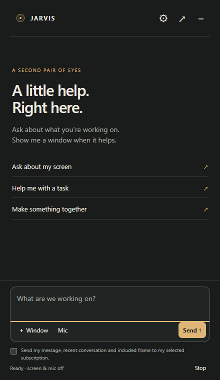
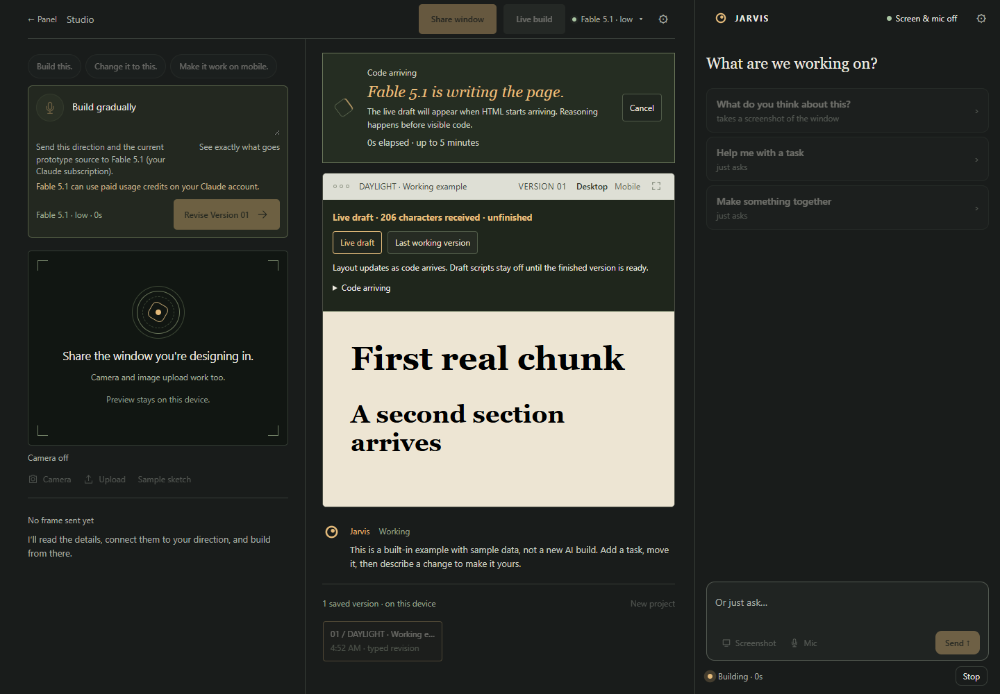
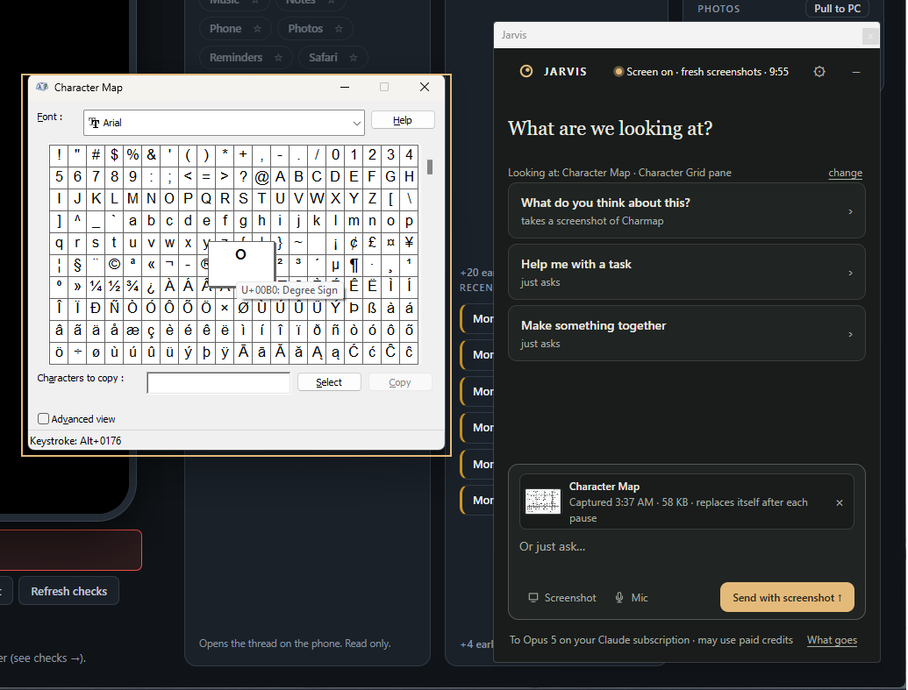
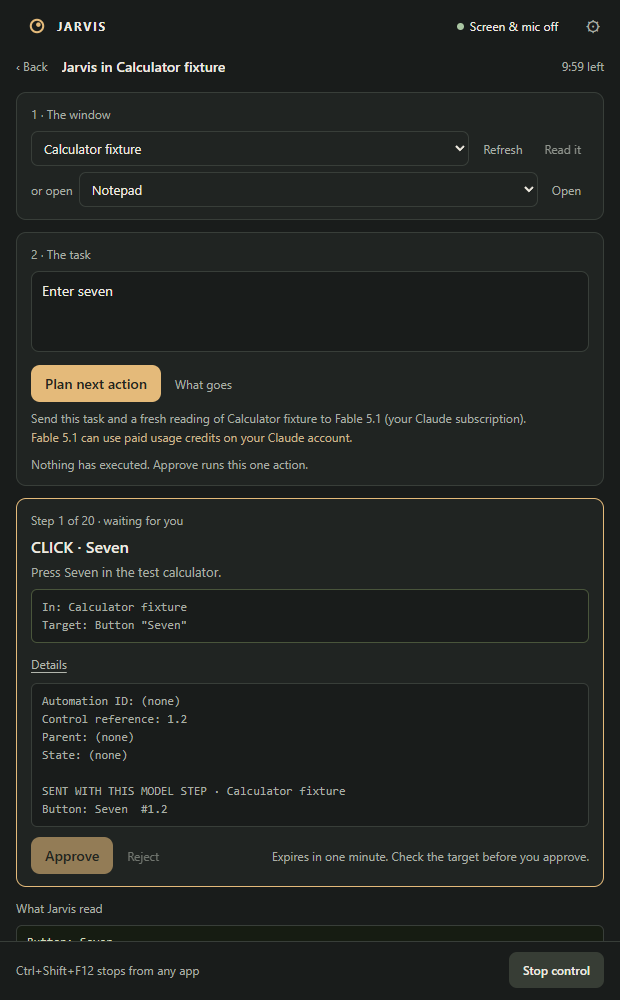

<div align="center">
  
  <h1>Jarvis</h1>
  <p><strong>A desktop companion for Windows that runs on the ChatGPT or Claude subscription you already pay for.</strong></p>
  <p><a href="https://github.com/ucsandman/jarvis/actions/workflows/ci.yml"></a> <a href="LICENSE"></a> <a href="https://github.com/ucsandman/jarvis/releases/latest"></a></p>
  <p><a href="https://jarvis-workbench.vercel.app/">Website</a> · <a href="https://github.com/ucsandman/jarvis/releases/download/v0.14.0/Jarvis-0.14.0-Windows-x64.exe">Download for Windows</a> · <a href="#getting-started">Get started</a> · <a href="CONTRIBUTING.md">Contribute</a></p>
</div>

Jarvis sits in the corner of your screen. Hit **Ctrl+Shift+Space** and the panel opens already knowing which window you were in, with three questions written for it as buttons. Pick one, look at the screenshot it took, press **Send with screenshot**. Or hand it something bigger: turn a sketch into a working prototype in the studio, or let it drive a Windows app one approved click at a time. Pick any model in the catalog, OpenAI through ChatGPT or Anthropic through Claude, go. No API key, nothing metered.

It's experimental and built around how I work. Anthropic models can burn paid Claude usage credits. What your account can reach is up to your plan. The website is a walkthrough, the app is where the sign-in and generation actually happen.



*The panel, captured from the packaged app with a browser window in front and a screenshot of the verifier's own fixture in the box. Nothing was sent; the button says what would go.*



*The studio during a build. This is the streaming check's synthetic draft, not a model reply; a real Fable build renders the same way.*

## What it does

- **Knows what was in front, and lets you change it.** The panel reads the title and process of the window you came from and offers three starters for it, each saying what it takes: "Unstick me · reads the text of Notepad", "What does this output mean? · takes a screenshot of WindowsTerminal", "Draft a reply" for mail. **change** on the "Looking at" line lists **Whole desktop** and every open window; pick one and the starters and Screenshot follow it. A window half off the screen or on another monitor captures whole. No pixels, no model call, until you press a starter or Screenshot.
- **Follows your clicks when you ask it to.** Press **Screen & mic off** in the header and choose **Follow my clicks** for ten minutes: whatever window you click is the one Jarvis looks at, a thin amber border marks it, and the starters refit to that app. **Follow and keep a fresh screenshot** also puts a screenshot of that window in the box three quiet seconds after each click, so your next question already has it; it never sends on its own. The header counts down and the same line stops it, as does **Ctrl+Shift+F12**.

  
- **Reads the exact text.** Error, terminal, spreadsheet and settings starters pull the accessible text of the window you came from through the same broker as Computer mode, read-only: every character is shown in the box with a count and whether it was cut short. Nothing is armed and nothing can click.
- **Copies, never reads.** Every reply has **Copy**. The clipboard is write-only; lint fails on any clipboard read in the page or the shell.
- **The button says what goes.** No checkbox, in the panel or the studio. A screenshot or window text sits in the box as a chip, and the Send button reads **Send**, **Send with screenshot** or **Send with window text**; the studio's reads **Build**, **Build with frame** or **Revise Version 02 with frame**. × removes it. The line under the button names the model and the account, and **What goes** shows the request body and every send this session. After a send the attachment leaves the box and stays on the message as evidence.
- **Asks the second question for you.** Three follow-ups under each reply. **Ctrl+Shift+E** summons, grabs the window you were in, fills the first starter, and stops at the Send button.
- **Build as you draw.** Open the studio, share your design window, turn on Live build, and Jarvis sends a snapshot after you pause and updates the prototype. Anthropic models stream HTML into a live draft; OpenAI models hand over finished messages.
- **Keep your versions.** Up to 12 stay in Jarvis's desktop profile. Restore one, read the source, download the HTML, import an old one.
- **Work inside Windows apps.** Computer mode lives in the panel. It reads the accessible controls of one window, proposes one action, and waits for your yes. [Computer mode guide](docs/COMPUTER.md).

## Getting started

1. [Download Jarvis 0.14.0](https://github.com/ucsandman/jarvis/releases/download/v0.14.0/Jarvis-0.14.0-Windows-x64.exe) and open it. No terminal, no Node, no admin.
2. Settings opens by itself until you're signed in. Pick an OpenAI or Anthropic model and use the sign-in button. Codex ships inside. For Anthropic models, **Install official Claude Code** downloads and verifies Anthropic's runtime.
3. Press a starter or type a question, then **Send**. **Screenshot** grabs the window you came from and shows it in the box before anything leaves; the button then reads **Send with screenshot**.
4. For a prototype, open the studio from Settings. **Share window**, press **Use this frame** to put one still in the box, describe the product, and press **Build with frame**. The line under the box names what goes, including the selected version's source once you have one. For hands-off updates, **Live build** has its own permission dialog.

**Ctrl+Shift+Space** brings the panel back. So does the desktop or Start menu shortcut. Closing the panel leaves Jarvis in the tray; **Quit Jarvis** from the tray menu stops the server.

Windows 10/11 x64 only. Chrome or Edge for screen sharing. The download is about 164 MiB. **The exe is unsigned**, so expect the unknown-publisher prompt. The [release has a SHA-256 checksum](https://github.com/ucsandman/jarvis/releases/tag/v0.14.0) and the bundled Node and Codex are publisher-verified. [Install, update, remove](docs/WINDOWS.md).

The companion needs the Microsoft Edge WebView2 Runtime. Jarvis checks on launch and tells you where to get it if it's missing. Its WebView profile is separate from any browser profile you used with an older install, so old revisions don't show up on their own. Export the HTML from the old profile, then **Settings, Advanced, Import a saved HTML prototype**. Imports cap at 120,000 bytes and add a version when the 12-slot history has room.

## Computer mode



*Computer mode as its own screen in the panel, from the browser check with a synthetic planner. Nothing happens until Approve.*

1. Settings, **Computer mode**. Allow local inspection for ten minutes and the screen takes over the panel: the window, the task, the one action waiting for you. **Back** returns to the conversation with control still on; **Open** on the line under the box brings the screen back.
2. Open an app or pick an open window. **Read it** reads its controls locally.
3. Type the task and press **Plan next action**. The line under it names the window whose fresh reading goes with the task, and **What goes** shows the body. Model and effort come from Settings.
4. Check the consequence, the window and the target; references and the full tree sit behind **Details**. **Approve** does one thing, then Jarvis reads the same window back once, locally, and shows what it observed next to what Windows accepted. If the window closed or could not be read, it says verification was unavailable. **Reject** does nothing. Plan again when you want the next step.
5. **Stop control** in the footer, or hit **Ctrl+Shift+F12** from anywhere. Stop doesn't undo what already ran.

A click or a key in the target app can send, delete, or buy something. Read every approval. Filters on names and commands are a safety net, not a promise that the app is trustworthy. Up to 20 model steps per session, each on your subscription or credits. [Capabilities, limits and protocol](docs/COMPUTER.md).

## Models and speed

| Model | Account | Preview while generating |
| --- | --- | --- |
| OpenAI models (Astra, GPT-5.6 Sol, Terra, Luna, GPT-5.5, GPT-5.4 Mini, GPT-5.3 Codex Spark) | ChatGPT subscription through Codex | Updates when the CLI finishes a message |
| Anthropic models (Fable 5.1, Opus 5, Sonnet 5, Haiku 4.5) | Paid Claude subscription through Claude Code | HTML drafts as chunks arrive |

Model and effort live in **Settings**; effort is under **Advanced**. Start on **low effort** for small changes. High effort can take a while.

Streaming doesn't skip the thinking time. One small Fable/low probe showed first HTML at 18.9s and finished at 20.5s. An earlier screen-based build took 60s. Different requests, not a benchmark. [Model and billing details](docs/MODELS.md).

## Live build

Live build compares small thumbnails locally. It waits for three quiet seconds and a real change, one request at a time. Minimum gap is **30 seconds**, **60 seconds**, or **two minutes**. It pauses after **ten builds per start**, when capture drops, or after an interrupted build. While it's on, the sharing line in the studio says so instead of showing a tick.

**Pause** stops snapshots and cancels the in-flight request. **Stop sharing** also releases capture. Reload never restarts sharing or Live build. Work the provider already received may still count against you.

Share the design window, not Jarvis, or you'll capture yourself. Animated windows may never settle. Drafts are visual only until a finished result validates. A new finished version resets the prototype's runtime data; saved source stays.

## Privacy and boundaries

| What | What happens |
| --- | --- |
| Window text | A text starter puts the accessible controls and values of one window in the box, every character shown, and they go with the next Send while the chip is there. Read-only; Computer mode stays off. |
| Clipboard | Copy writes a reply to it. Nothing reads it. |
| Which window Jarvis looks at | The shell keeps the title and process name of the window that was in front, or the one you picked with **change**, only to pick starter labels and the capture target. **change** lists the titles and app names of open windows; no pixels. Nothing sends the title without a screenshot or text. A pick lasts until the next summon. **Whole desktop** captures every monitor with the panel hidden. |
| Screen on | Off until you press the header line. While on, the shell watches mouse button-ups only (no keys, no coordinates kept), pins the window under each click, and reads the clicked control's accessible name and type, never its value. Screenshots land in the box and wait for Send. Ten minutes, a countdown, the border on the desktop, and one press to stop. |
| Camera and screen | Preview stays local and attaches nothing. A panel message sends the screenshot in the box, if any; a build sends the one frame attached in the box, taken with **Use this frame**. Live build sends changed snapshots after its own permission. No video stream, no desktop audio. |
| Model input | Your message or direction, the screenshot in the box and the selected source go to the provider through its official CLI. The Send button names the attachment; **What goes** shows the body. |
| Accounts | The CLI owns sign-in. Jarvis never reads credential files, never takes an API key, never falls back to another model. |
| Drafts | Partial HTML isn't saved. Scripts are off. Draft URLs expire when the build ends. Reasoning and raw CLI logs aren't shown. |
| Finished prototypes | Run in a locked-down iframe: no network, no nested frames, no camera or mic. Downloaded HTML runs outside that box. |
| Computer mode | Window choice is local. **Plan next action** sends a fresh bounded accessibility tree, editable values, the task and recent actions; the line under the button says so. No screenshot, no audio. History is session-only. |
| Saved work | Versions and reference images live in Jarvis's desktop profile on this machine. |
| Sent this session | The ledger in **What goes** lists every send and every refusal. It resets when Jarvis reloads. |

The builder makes frontend pages. Computer mode, enabled separately, drives accessible Windows controls with per-action approval. It is not general desktop automation: no canvas, no Explorer, no address bars, no terminals, no admin prompts. No shell tool, no repo editing, no backend, no deploy. Read generated output before you use it somewhere else. [Security details and reporting](SECURITY.md).

## Run from source

Needs **Node.js 24+** and a subscription for generation. Setup can install the CLI on Windows. Elsewhere, install the official CLI yourself. [Provider setup](docs/MODELS.md).

```sh
git clone https://github.com/ucsandman/jarvis.git
cd jarvis
npm ci
npm start
```

Open **http://127.0.0.1:4317**. Zero runtime dependencies. **Start Jarvis.cmd** works too once Node is installed. In a plain browser the studio opens first; add `?companion` to start in the panel.

## Development and verification

```sh
npm test
npm run lint
npm run build
npm run verify:assistant
npm run verify:companion
npm run verify:computer
npm run verify:recovery
npm run verify:stream
node scripts/verify-live.mjs
node scripts/verify-models.mjs
node scripts/verify-desktop-content.mjs
```

Browser checks need Chrome plus Playwright or a global `@playwright/cli`. They use synthetic generation and don't touch your allowance. Live-provider checks are separate and do. `npm run lint` also checks that every served asset exists, every local reference is served, and nothing in `public/*.css` is set below 12px. CI runs install, tests, lint and build on Windows and Linux.

Prewritten prompts live in `public/chips.js`. The activity and sensor lines, the Send label, the studio's sharing sentence, the gate and the ledger live in `public/harness.js` and are unit-tested in `tests/harness.test.mjs`.

Changed the mark? Run `powershell -NoProfile -File scripts/build-icon.ps1` to regenerate `desktop/jarvis.ico`.

[Contributing](CONTRIBUTING.md) · [Changelog](CHANGELOG.md) · [Windows packaging](docs/WINDOWS.md) · [Site runbook](docs/SITE.md) · [Verification history](PLAYBOOK.md)

## Troubleshooting

| Problem | Try |
| --- | --- |
| Slow generation | Drop to low effort in Settings, Advanced, ask for less, or cancel. Anthropic models stream drafts; OpenAI models stay quiet until they're done. |
| Model or login unavailable | Open Settings, use the sign-in or install button, then Check again. |
| Send is greyed out | The line under the box says why: reconnect, sign in, or start a new allowance in Settings. |
| The starters don't match the window | Press **change** on the "Looking at" line and pick the window, or **Whole desktop** for the generic three. |
| A minimized window flashed on screen | Jarvis shows it without taking focus, captures it, then minimizes it again. Pick it under **change**, where the picker marks it "minimized". |
| Ctrl+Shift+E does nothing | Another app owns it. Settings says so at the bottom; Ctrl+Shift+Space still works. |
| Can't share the screen | Use Chrome or Edge, upload an image, or use the camera. |
| Live build paused | Read the message, check the shared window and your allowance, start it again yourself. |
| Preview failed | Retry preview or download the source. Don't regenerate just to reopen it. |
| Saved work missing | Same installed Jarvis profile? Older browser installs are separate. Export there, then **Settings, Advanced, Import a saved HTML prototype**. |
| Port taken | Quit whatever is on 4317, reopen Jarvis. |

## License

Jarvis is [MIT](LICENSE). Node.js, Codex and Claude Code keep their own licenses. Upstream notices ship with the bundled runtimes; Claude Code is downloaded separately through Setup.
