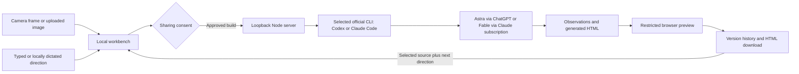

<div align="center">
  
  <h1>Jarvis</h1>
  <p><strong>Show a sketch. Describe the idea. Try the working prototype.</strong></p>
  <p>A camera-aware workbench that turns references from your desk into interactive web interfaces.</p>
  <p>
    <a href="https://github.com/ucsandman/jarvis/actions/workflows/ci.yml"></a>
    
    
    
    
  </p>
  <p><a href="#quick-start">Quick start</a> · <a href="#the-demo">Demo</a> · <a href="#how-it-works">Architecture</a> · <a href="#privacy-and-control">Privacy</a> · <a href="CONTRIBUTING.md">Contributing</a></p>
</div>

**[See how Jarvis works](https://jarvis-workbench.vercel.app/)** or **[download Jarvis for Windows](https://github.com/ucsandman/jarvis/releases/download/v0.4.0/Jarvis-0.4.0-Windows-x64.exe)**. Real generation runs locally through your own eligible ChatGPT or Claude subscription; the public site shows a prepared walkthrough and does not host subscription login or inference.

Public-site maintenance and deployment: [site runbook](docs/SITE.md).


*The included working example runs locally before sign-in. It is labeled sample content, not a new AI generation.*

## What you can do

| From your desk | In Jarvis |
| --- | --- |
| A sketch on paper or a whiteboard | Capture one frame, inspect what Jarvis sees, and build an interactive interface. |
| A screenshot or design reference | Upload it and describe the behavior you want. |
| A change of direction | Type or dictate a revision to the selected version. |
| A prototype worth keeping | Try its controls, compare versions, inspect the source, and download the HTML. |

The workbench includes a working example before sign-in, setup and reconnect controls, desktop and mobile preview sizes, expanded preview, up to 12 saved versions, editable local dictation on Windows, and optional spoken replies using a locally installed English voice. Completed source is saved before preview loading, so a preview failure can be retried without another model request.

**Choose Astra through Codex and ChatGPT, or Fable 5.1 through Claude Code and your Claude subscription. Choose low, medium, high, xhigh, or max effort for each build. Fable can automatically consume paid usage credits under your Claude account settings. Jarvis has no model API integration, API keys, or automatic model fallback.**

## The demo

The included DAYLIGHT sketch becomes a task board with working task creation, search, completion, and move controls. A second instruction adds a 25-minute Focus timer while preserving the board.

> Preserve the task board. Add a compact 25-minute Focus timer with Start, Pause, and Reset.


*The actual second version from a live subscription-backed revision. Start, Pause, Reset, task creation, filtering, and all three board columns were checked in the browser.*

Try the same loop with your own sketch, or choose **Try a sample sketch** to start without a camera. Generated results vary. These screenshots show verified outputs, not a fixed template returned for every request.

## Quick start

### Windows: download and open

1. Download **Jarvis-0.4.0-Windows-x64.exe** using the link above and open it. Node and the official Codex CLI are included; no terminal, npm, or administrator access is required.
2. Choose **Astra** or **Fable 5.1**, then an effort level. In **Setup**, use the selected provider’s sign-in button. For Fable, **Install official Claude Code** downloads Anthropic’s verified runtime if needed. Existing eligible subscription sign-in is reused.
3. Use the **Jarvis** shortcut on your desktop or Start menu next time. The tray menu has **Open Jarvis** and **Quit Jarvis**. Closing the browser leaves Jarvis running; Quit stops its server and child processes.

Windows 10/11 x64 and a modern browser are required. The download is about 164 MiB and expands into your per-user application data directory. The outer Jarvis executable is unsigned, so Windows may show an unknown-publisher warning. The included Node and Codex binaries have verified upstream signatures. [Release notes and SHA-256 checksum](https://github.com/ucsandman/jarvis/releases/tag/v0.4.0) accompany the download. [Windows packaging and lifecycle details](docs/WINDOWS.md).

A camera is optional. Access and allowance depend on the selected account. Fable can use paid Claude usage credits. Jarvis stops if the selected model is unavailable.

### Run from source (developers)

- **Node.js 24 or newer.**
- **Official Codex CLI installed through npm** for Astra/ChatGPT, or **Claude Code 2.1.261** for Fable/Claude. On Windows, Setup can install either selected CLI after confirmation.
- A modern browser. Chrome on Windows was used for end-to-end verification.
- A camera is optional. Windows English speech recognition and a default microphone are needed only for local dictation.

Model access and subscription limits depend on your account. This project does not provision access. If the selected model is unavailable, Jarvis stops; Fable can consume paid Claude usage credits.

The source checkout still supports **Start Jarvis.cmd** on Windows after installing Node. This developer path requires the prerequisites above; the executable download includes them.

For Astra, in **Setup**, choose **Install official Codex CLI** if needed, then **Sign in with ChatGPT**. Installation downloads the official npm package globally from the npm registry. Sign-in opens the official browser flow and changes the local Codex login only after you choose it. **Check again** refreshes readiness. For Fable, select it first, then use the Claude Code install and Claude sign-in buttons. On Windows the installer verifies the pinned archive checksum and Anthropic publisher signature. The working example is available without either account.

For a terminal launch on Windows, macOS, or Linux:

```sh
git clone https://github.com/ucsandman/jarvis.git
cd jarvis
npm ci
npm start
```

Open **http://127.0.0.1:4317**. Use the same URL and browser profile to retain access to saved versions.

Jarvis has zero application package dependencies. The official Codex npm package and optional browser QA tools are separate prerequisites. Standard and custom npm prefixes on PATH are supported; Codex standalone native installations are not currently discovered; Claude Code native installations are supported. Jarvis checks the installed package name and entry point, not cryptographic integrity of local files. See the [official Codex documentation](https://developers.openai.com/codex/) and [authentication guide](https://developers.openai.com/codex/auth).

### Your first build

1. Choose **Try the working example** to add, move, and search sample tasks immediately, without inference or camera access.
2. Choose **Try a sample sketch**, upload a reference, connect a camera, or type an idea.
3. Check **Include the selected frame** only when you want that image sent. Describe the behavior you want.
4. Click **Make it real** and review the sharing consent. A visual build returns observations and the prototype together in one subscription turn.
5. Try the controls, then type a change. The previous frame remains visible as evidence, but is unchecked for the next request. Check it again or select a new reference to include it.
6. Reopen versions, inspect **Source**, or **Download** the HTML. If preview loading fails, choose **Retry preview**; completed source remains available.

For readable camera input, fill the frame with the page and use even lighting. The preview is not mirrored. Dictation returns editable text; you still click Build to send it.

## How it works



Both visual builds and typed revisions use one subscription turn. A visual response includes observations and generated HTML; unreadable references are rejected. A typed revision uses the selected source without resending the old image. The separate observation endpoint remains available for explicit analysis and diagnostics.

The server validates inputs, enforces consent and request limits, and starts an isolated CLI process. The invocation pins the model, requires the selected provider’s subscription login, ignores user provider overrides, strips inherited API credentials and endpoint overrides, disables tools and integrations, and uses an ephemeral working directory. Codex runs read-only; Claude Code runs in safe mode with no executable tools and only structured output enabled. The CLI manages its own authentication.

Generated applications run inside an opaque-origin iframe with restrictive content security policy. Source revisions and reference images stay in this browser's IndexedDB. Server preview copies are held only in bounded memory.

<details>
<summary><strong>Project structure</strong></summary>

```text
public/               Workbench UI, browser storage, and sample sketch
lib/subscription.mjs  Subscription routing and Codex transport
lib/claude.mjs        Verified Claude Code subscription transport
lib/models.mjs        Fixed model and effort allowlist
lib/vision.mjs        Observation/generation prompts and validation
server.mjs            Loopback server and preview security policy
scripts/              Launcher, local dictation, and verification tools
tests/                Server and subscription-boundary tests
docs/images/          Reviewed screenshots from the real demo
.github/workflows/    Windows and Linux checks
```

</details>

## Privacy and control

| Boundary | Behavior |
| --- | --- |
| Camera | Preview stays local. Only the selected frame is shared when you build. No continuous stream is uploaded. |
| Model input | Selected image, direction, and selected prototype source go through the official subscription-authenticated CLI after consent. |
| Credentials | Jarvis does not read environment files or subscription credentials. API-key authentication is rejected. |
| Generated code | Runs in a restricted preview with network requests, nested frames, form destinations, and camera/microphone permissions blocked. |
| Cancellation | Stops the owned CLI process. Canceled results are not accepted, although provider-side work may already have occurred. |
| Storage | Up to 12 source versions and their references persist locally. **New project** clears the browser's project after confirmation. |
| Limits | One build or setup operation at a time, 60 model operations per local allowance, a two-minute standalone observation timeout, and a five-minute generation timeout. Setup can explicitly renew the local allowance; this does not renew subscription limits. |

The workbench runs locally; inference is remote through your subscription. Your provider's terms, data handling, and usage limits apply. See [SECURITY.md](SECURITY.md) for the security boundary and vulnerability reporting.

## Current limits

- **Snapshot-based awareness.** Jarvis reads chosen frames. It does not continuously understand or control a room.
- **Frontend prototypes.** It does not edit repositories, build backends, deploy services, or execute generated code on the host computer.
- **Generation takes time.** One verified combined visual build took 209.7 seconds at medium reasoning effort. This is a single measurement, not a latency guarantee or a controlled speedup comparison. Progress and the timeout countdown stay visible; builds may still time out.
- **Source persists; runtime state resets.** Data entered inside a generated preview resets when it is reopened. Saved source versions remain available.
- **Windows-first verification.** Real generation and browser checks were performed on Windows. Linux CI covers unit tests and syntax checks, not camera, speech, or live inference.
- **Voice is platform-specific.** Dictation uses Windows English speech recognition. Other platforms can type. Live microphone dictation and real webcam sharing have not been verified end to end.
- **Generated output needs review.** A sandbox limits access; it does not guarantee correct or trustworthy code. Downloaded HTML runs outside the preview restrictions.
- **Two verified models.** Only Astra and Fable 5.1 are supported. Fable uses verified Claude Code 2.1.261; Setup installs that version if an existing version differs. [Model, effort, and billing details](docs/MODELS.md).

## Development and verification

```sh
npm run dev       # Restart the server after source changes
npm test          # 28 tests; no model calls or account required
npm run lint      # JavaScript syntax and required-asset checks
npm run build     # Same checks; no compilation step required
```

There is no third-party lint engine or bundler. CI runs installation, tests, lint, and build on Node.js 24 on Windows and Linux. It never calls a model or uses subscription credentials.

The model-selection release passes **28 unit tests**, **13 model/effort browser checks**, and **9 recovery browser checks**. Browser checks reported zero page errors. A real combined visual build also completed through the subscription CLI. See [PLAYBOOK.md](PLAYBOOK.md) for scope and limitations.

<details>
<summary><strong>Optional end-to-end browser checks</strong></summary>

Requires Chrome and Playwright, either installed locally or available through an existing global `@playwright/cli` installation. `npm run verify:recovery` starts its own isolated service and uses synthetic responses; it makes no model, installation, or login calls. The live demo checks below require Jarvis to be running.

```sh
npm run verify:recovery
npm run verify:vision
npm run verify:browser
node scripts/verify-revision.mjs
```

Run these in order:

1. `verify:vision` sends the included synthetic sketch in one combined build through your ChatGPT subscription and saves the actual response and observations in ignored `.artifacts/` files.
2. `verify:browser` exercises the workbench with that recorded response, without further inference.
3. `verify-revision` checks the generated task board and makes one real revision through the UI.

Live checks consume subscription allowance, require Astra access, and can take several minutes. They never upload your webcam. Generated-code checks expect the task-board scenario requested by the script and may fail if generation does not follow it.

</details>

## Troubleshooting

| Symptom | What to check |
| --- | --- |
| Codex is missing | Open Setup and choose Install official Codex CLI, confirm, then Check again. Installation may require an npm prefix writable by your user. |
| Subscription is unavailable | Choose Sign in with ChatGPT or Check again in Setup. Model access is checked on a real build. API-key login is not supported. |
| A build times out or reaches a usage limit | The existing version stays available. Try a smaller revision or wait for your subscription allowance to recover. |
| Camera cannot start | Check site permission and whether another app is using the camera. Upload a reference or try the sample instead. |
| Dictation cannot start | Check the default Windows microphone and installed English recognizer. Typed directions remain available. |
| Saved versions seem missing | Use the same browser profile and URL. `localhost` and `127.0.0.1` have separate browser storage. |
| Session expired after a restart | Choose Reconnect. Saved source remains available while the session reconnects. |
| Preview did not load | Choose Retry preview or Download. Do not regenerate a completed version just to reopen it. |
| Local request allowance is used up | Choose Start new allowance in Setup and confirm. This does not change provider subscription limits. |
| Port 4317 is occupied | The launcher reuses a healthy Jarvis process. If another application owns the port, close it before launching Jarvis. |

## Contributing

See [CONTRIBUTING.md](CONTRIBUTING.md) for development steps and architecture rules. Report reproducible bugs through [GitHub Issues](https://github.com/ucsandman/jarvis/issues). For security issues, follow [SECURITY.md](SECURITY.md).

[Changelog](CHANGELOG.md) · [Build notes](PLAYBOOK.md) · [Architecture constraints](AGENTS.md)
