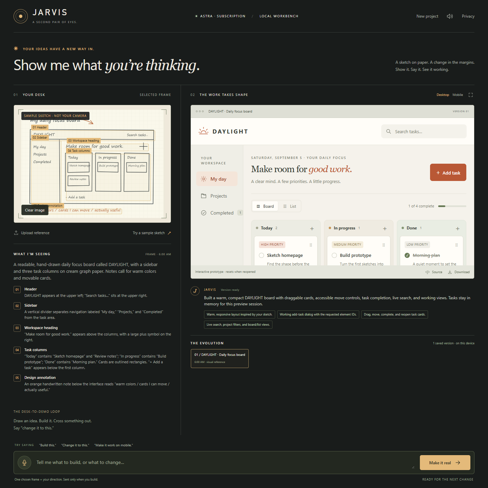

<div align="center">
  
  <h1>Jarvis</h1>
  <p><strong>Show a sketch. Describe the idea. Try the working prototype.</strong></p>
  <p>A camera-aware workbench that turns references from your desk into interactive web interfaces.</p>
  <p>
    <a href="https://github.com/ucsandman/jarvis/actions/workflows/ci.yml"></a>
    
    
    
    
  </p>
  <p><a href="#quick-start">Quick start</a> · <a href="#the-demo">Demo</a> · <a href="#how-it-works">Architecture</a> · <a href="#privacy-and-control">Privacy</a> · <a href="CONTRIBUTING.md">Contributing</a></p>
</div>



*Real workbench screenshot. The reference is the included synthetic sketch. Astra generated the prototype through a ChatGPT subscription.*

## What you can do

| From your desk | In Jarvis |
| --- | --- |
| A sketch on paper or a whiteboard | Capture one frame, inspect what Jarvis sees, and build an interactive interface. |
| A screenshot or design reference | Upload it and describe the behavior you want. |
| A change of direction | Type or dictate a revision to the selected version. |
| A prototype worth keeping | Try its controls, compare versions, inspect the source, and download the HTML. |

The workbench includes desktop and mobile preview sizes, expanded preview, up to 12 saved versions, editable local dictation on Windows, and optional spoken replies using a locally installed English voice.

**Inference uses `gpt-6-astra` through the official Codex CLI, authenticated with a ChatGPT subscription. Jarvis never uses a metered model API, accepts API keys, extracts subscription tokens, or falls back to another model.**

## The demo

The included DAYLIGHT sketch becomes a task board with working task creation, search, completion, and move controls. A second instruction adds a 25-minute Focus timer while preserving the board.

> Preserve the task board. Add a compact 25-minute Focus timer with Start, Pause, and Reset.


*The actual second version from a live subscription-backed revision. Start, Pause, Reset, task creation, filtering, and all three board columns were checked in the browser.*

Try the same loop with your own sketch, or choose **Try a sample sketch** to start without a camera. Generated results vary. These screenshots show verified outputs, not a fixed template returned for every request.

## Quick start

### Requirements

- **Node.js 24 or newer.**
- **Official Codex CLI**, signed in using **ChatGPT**, with access to `gpt-6-astra`.
- A modern browser. Chrome on Windows was used for end-to-end verification.
- A camera is optional. Windows English speech recognition and a default microphone are needed only for local dictation.

Model access and subscription limits depend on your account. This project does not provision access. If Astra is unavailable, Jarvis stops instead of selecting another model or billing route.

### Install and launch

```sh
git clone https://github.com/ucsandman/jarvis.git
cd jarvis
npm ci
codex login status
npm start
```

The login status must say **Logged in using ChatGPT**. For Codex installation and sign-in, use the [official documentation](https://developers.openai.com/codex/) and [authentication guide](https://developers.openai.com/codex/auth).

Open **http://127.0.0.1:4317**. On Windows, subsequent launches can use **Start Jarvis.cmd**, which starts the server when needed and opens your browser.

Jarvis has zero application package dependencies. Codex and optional browser QA tools are separate prerequisites. On Windows, the launcher currently expects the standard global npm installation of Codex under the user's roaming application directory.

### Your first build

1. Choose **Connect camera**, **Upload reference**, or **Try a sample sketch**.
2. Type a direction: “Build this task board. Make adding, moving, and filtering tasks work.”
3. Click **Make it real** and review the sharing consent.
4. Try the controls inside the preview.
5. Type a change and build again, or select **Back to live camera** to capture another reference.
6. Reopen a saved version, inspect **Source**, or **Download** the standalone HTML.

For readable camera input, fill the frame with the page and use even lighting. The preview is not mirrored. Dictation returns editable text; you still click Build to send it.

## How it works


A visual build uses two subscription turns: observation, then generation. A text-only revision uses one generation turn with the selected version's source as context.

The server validates inputs, enforces consent and request limits, and starts an isolated CLI process. The invocation pins the model, forces ChatGPT login, ignores user provider overrides, strips inherited API credentials and endpoint overrides, disables tools and integrations, and uses ephemeral mode with a read-only sandbox. The CLI manages its own authentication.

Generated applications run inside an opaque-origin iframe with restrictive content security policy. Source revisions and reference images stay in this browser's IndexedDB. Server preview copies are held only in bounded memory.

<details>
<summary><strong>Project structure</strong></summary>

```text
public/               Workbench UI, browser storage, and sample sketch
lib/subscription.mjs  Subscription-only Codex process transport
lib/vision.mjs        Observation/generation prompts and validation
server.mjs            Loopback server and preview security policy
scripts/              Launcher, local dictation, and verification tools
tests/                Server and subscription-boundary tests
docs/images/          Reviewed screenshots from the real demo
.github/workflows/    Windows and Linux checks
```

</details>

## Privacy and control

| Boundary | Behavior |
| --- | --- |
| Camera | Preview stays local. Only the selected frame is shared when you build. No continuous stream is uploaded. |
| Model input | Selected image, direction, and selected prototype source go through the official subscription-authenticated CLI after consent. |
| Credentials | Jarvis does not read environment files or subscription credentials. API-key authentication is rejected. |
| Generated code | Runs in a restricted preview with network requests, nested frames, form destinations, and camera/microphone permissions blocked. |
| Cancellation | Stops the owned CLI process. Canceled results are not accepted, although provider-side work may already have occurred. |
| Storage | Up to 12 source versions and their references persist locally. **New project** clears the browser's project after confirmation. |
| Limits | One model operation at a time, at most 60 operations per server session, a two-minute observation timeout, and a five-minute generation timeout. |

The workbench runs locally; inference is remote through your subscription. Your provider's terms, data handling, and usage limits apply. See [SECURITY.md](SECURITY.md) for the security boundary and vulnerability reporting.

## Current limits

- **Snapshot-based awareness.** Jarvis reads chosen frames. It does not continuously understand or control a room.
- **Frontend prototypes.** It does not edit repositories, build backends, deploy services, or execute generated code on the host computer.
- **Generation takes time.** One verified build took 237.5 seconds at high reasoning effort. The application currently requests medium effort. Results can take minutes and may time out.
- **Source persists; runtime state resets.** Data entered inside a generated preview resets when it is reopened. Saved source versions remain available.
- **Windows-first verification.** Real generation and browser checks were performed on Windows. Linux CI covers unit tests and syntax checks, not camera, speech, or live inference.
- **Voice is platform-specific.** Dictation uses Windows English speech recognition. Other platforms can type. Live microphone dictation and real webcam sharing have not been verified end to end.
- **Generated output needs review.** A sandbox limits access; it does not guarantee correct or trustworthy code. Downloaded HTML runs outside the preview restrictions.
- **Astra only today.** Fable through an Anthropic subscription is permitted by the architecture, but no Anthropic integration is implemented.

## Development and verification

```sh
npm run dev       # Restart the server after source changes
npm test          # 13 tests; no model calls or account required
npm run lint      # JavaScript syntax and required-asset checks
npm run build     # Same checks; no compilation step required
```

There is no third-party lint engine or bundler. CI runs installation, tests, lint, and build on Node.js 24 on Windows and Linux. It never calls a model or uses subscription credentials.

The initial demo was verified with **13 unit tests**, **8 workbench browser checks**, and **5 follow-up checks of the generated revision**, with zero browser page errors in those runs. See [PLAYBOOK.md](PLAYBOOK.md) for the scope of the evidence.

<details>
<summary><strong>Optional end-to-end browser checks</strong></summary>

Requires Chrome and Playwright, either installed locally or available through an existing global `@playwright/cli` installation. Start Jarvis in a separate terminal first.

```sh
npm run verify:vision
npm run verify:browser
node scripts/verify-revision.mjs
```

Run these in order:

1. `verify:vision` sends the included synthetic sketch through your ChatGPT subscription and saves the actual response in ignored `.artifacts/` files.
2. `verify:browser` exercises the workbench with that recorded response, without further inference.
3. `verify-revision` checks the generated task board and makes one real revision through the UI.

Live checks consume subscription allowance, require Astra access, and can take several minutes. They never upload your webcam. Generated-code checks expect the task-board scenario requested by the script and may fail if generation does not follow it.

</details>

## Troubleshooting

| Symptom | What to check |
| --- | --- |
| Codex is missing | Install the official CLI. On Windows, this release expects the standard global npm installation. |
| Subscription is unavailable | Run `codex login status`. Use ChatGPT sign-in and verify Astra access. API-key login is not supported. |
| A build times out or reaches a usage limit | The existing version stays available. Try a smaller revision or wait for your subscription allowance to recover. |
| Camera cannot start | Check site permission and whether another app is using the camera. Upload a reference or try the sample instead. |
| Dictation cannot start | Check the default Windows microphone and installed English recognizer. Typed directions remain available. |
| Saved versions seem missing | Use the same browser profile and URL. `localhost` and `127.0.0.1` have separate browser storage. |
| Session expired after a restart | Refresh the page. Each server process creates a new session token. |
| Port 4317 is occupied | Check whether Jarvis is already running and open the existing page. |

## Contributing

See [CONTRIBUTING.md](CONTRIBUTING.md) for development steps and architecture rules. Report reproducible bugs through [GitHub Issues](https://github.com/ucsandman/jarvis/issues). For security issues, follow [SECURITY.md](SECURITY.md).

[Changelog](CHANGELOG.md) · [Build notes](PLAYBOOK.md) · [Architecture constraints](AGENTS.md)
