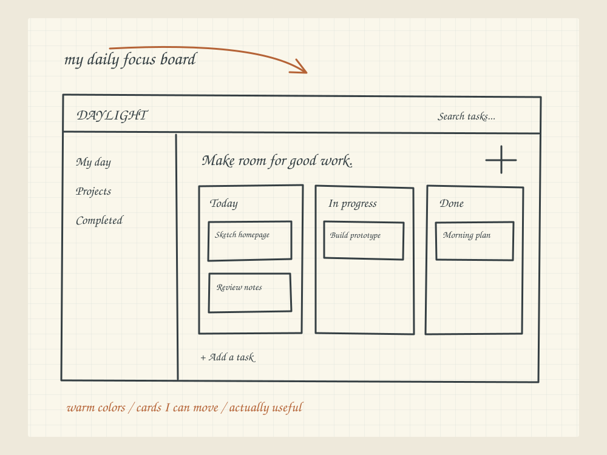

# Screen On Implementation Plan

> **For agentic workers:** REQUIRED SUB-SKILL: Use superpowers:subagent-driven-development (recommended) or superpowers:executing-plans to implement this plan task-by-task. Steps use checkbox (`- [ ]`) syntax for tracking.

**Goal:** The panel's "Screen & mic off" line becomes a ten-minute lease under which Jarvis's target follows the window you click, a desktop border marks it, and (optionally) a fresh screenshot of it waits in the box after you pause.

**Architecture:** Shell-side, a `WH_MOUSE_LL` hook and a click-through border form live in a new `FollowService`, wired through the existing `Select`/`DescribeForeground` pin so capture and label agree. Page-side, a pure reducer in `public/follow.js` decides when to regenerate starters and when to request a capture; the existing `capture` message and `setFrame` chip carry the screenshot. No server, broker or model changes.

**Tech Stack:** Vanilla ES modules (no bundler), `node --test`, Playwright verifier (`scripts/verify-companion.mjs`), C# WinForms shell compiled by `csc.exe` in `scripts/build-windows.ps1`, PowerShell native checks.

**Spec:** `plans/2026-09-05-screen-on-design.md`

## Global Constraints

- The panel has no checkbox, nothing scrolls at rest, no horizontal overflow at 360px; `verify:companion` asserts all three and must keep passing.
- No text under 12px in `public/*.css` (lint fails).
- The clipboard stays write-only (lint scans `desktop/*.cs` too; never call a clipboard read).
- No model call happens on its own. A screenshot lands in the box; only Send sends it.
- Sensor words come first in the header, always: `screen on · …`, `mic on (local)`.
- Consent is a button, not a tick. The lease dialog has no checkbox.
- Only mouse button-up events are observed, only while the lease is on. No keyboard hook. Never read a control's value. Skip password controls and windows with a capture-blocking display affinity.
- Copy voice: plain, quiet, no hype. Match neighbouring strings in `public/index.html` and `README.md`.
- Commit format: `Claude: [TYPE] brief description` with the Co-Authored-By and Claude-Session trailers used in this repo's recent commits.
- Mock before wire: Task 0 is a hard gate. No code from Task 1 onward until Wes says "go" on the mock.

---

### Task 0: Mock the five states (gate)

**Files:**
- Create: `.artifacts/screen-on-mock.html` (gitignored; the PNG is the record)
- Create: `.artifacts/screen-on-mock.png`

**Interfaces:**
- Produces: the approved copy for the header line, the lease dialog, the "Looking at" line with an element, the off note. Later tasks copy strings from here verbatim.

- [ ] **Step 1: Write the mock.** Five 440px panels side by side, real stylesheets, static markup. Reuse the live panel's classes so the mock cannot drift from the product.

```html
<!doctype html><meta charset="utf-8"><title>Screen on · five states</title>
<link rel="stylesheet" href="../public/style.css"><link rel="stylesheet" href="../public/companion.css">
<style>body{display:flex;gap:24px;padding:24px;background:#0b0b0a;overflow:auto}.state{width:440px;flex:none}.state h2{font:12px system-ui;color:#999;margin:0 0 8px}#companion{height:700px}
.companion-sense{cursor:pointer;background:none;border:0;padding:6px 8px;border-radius:8px}.companion-sense:hover{background:#2b302c}
.companion-note{font-size:12px;color:var(--muted);margin:6px 0 0}
</style>
<!-- State 1: off -->
<div class="state"><h2>1 · Off</h2><section id="companion"><header class="companion-header"><button class="companion-brand">JARVIS</button><button class="companion-sense"><i id="companion-dot"></i><span role="status">Screen &amp; mic off</span></button><button aria-label="Settings">⚙</button><button aria-label="Return to dock">−</button></header>
<div class="companion-scroll"><h1>What are we looking at?</h1><p id="companion-front"><span id="companion-front-title">Looking at: Inbox – Gmail – Brave</span><button class="quiet">change</button></p>
<div class="companion-starters"><button class="starter"><span><strong>Summarize this page</strong><small>takes a screenshot of Brave</small></span></button><button class="starter"><span><strong>Draft a reply</strong><small>takes a screenshot of Brave</small></span></button><button class="starter"><span><strong>What should I click next?</strong><small>takes a screenshot of Brave</small></span></button></div></div>
<div class="companion-compose"><form><textarea rows="2" placeholder="Or just ask…"></textarea><div class="companion-tools"><button type="button">Screenshot</button><button type="button">Mic</button><button type="submit" id="companion-send">Send ↑</button></div></form><p class="companion-goes">To Opus 5 on your Claude subscription · may use paid credits</p></div></section></div>
<!-- State 2: lease dialog, drawn open over state 1 -->
<div class="state"><h2>2 · Lease</h2><section id="companion" style="position:relative"><header class="companion-header"><button class="companion-brand">JARVIS</button><button class="companion-sense"><i id="companion-dot"></i><span>Screen &amp; mic off</span></button><button>⚙</button><button>−</button></header>
<dialog open style="position:absolute;inset:auto 16px 120px 16px;margin:0"><h2>Let Jarvis follow your screen?</h2><p>For the next 10 minutes, whatever window you click is the one Jarvis looks at. A thin amber border marks it. Starters refit to that app.</p><p>Pixels stay on this computer until you press Send. No microphone, no keyboard, no clicking on your behalf.</p><p>Press the header line or Ctrl+Shift+F12 to stop early.</p>
<div class="dialog-actions"><button class="button secondary">Not now</button><button class="button amber">Follow my clicks</button><button class="button amber">Follow and keep a fresh screenshot</button></div></dialog></section></div>
<!-- State 3: on, following -->
<div class="state"><h2>3 · Following</h2><section id="companion"><header class="companion-header"><button class="companion-brand">JARVIS</button><button class="companion-sense"><i id="companion-dot" class="on"></i><span role="status">Screen on · following clicks · 9:42</span></button><button>⚙</button><button>−</button></header>
<div class="companion-scroll"><h1>What are we looking at?</h1><p id="companion-front"><span id="companion-front-title">Looking at: Inbox – Gmail · Send button</span><button class="quiet">change</button></p>
<div class="companion-starters"><button class="starter"><span><strong>Summarize this page</strong><small>takes a screenshot of Brave</small></span></button><button class="starter"><span><strong>Draft a reply</strong><small>takes a screenshot of Brave</small></span></button><button class="starter"><span><strong>What should I click next?</strong><small>takes a screenshot of Brave</small></span></button></div></div>
<div class="companion-compose"><form><textarea rows="2" placeholder="Or just ask…"></textarea><div class="companion-tools"><button type="button">Screenshot</button><button type="button">Mic</button><button type="submit">Send ↑</button></div></form><p class="companion-goes">To Opus 5 on your Claude subscription · may use paid credits</p></div></section></div>
<!-- State 4: on, fresh screenshot in the box -->
<div class="state"><h2>4 · Fresh screenshot</h2><section id="companion"><header class="companion-header"><button class="companion-brand">JARVIS</button><button class="companion-sense"><i id="companion-dot" class="on"></i><span>Screen on · fresh screenshots · 9:12</span></button><button>⚙</button><button>−</button></header>
<div class="companion-scroll"><h1>What are we looking at?</h1><p id="companion-front"><span id="companion-front-title">Looking at: Inbox – Gmail · Compose button</span><button class="quiet">change</button></p></div>
<div class="companion-compose"><form><div class="companion-attach"><div class="companion-att"><span><b>Inbox – Gmail – Brave</b><small>Captured 3:41 PM · 212 KB · replaces itself after each pause</small></span><button type="button">×</button></div></div><textarea rows="2" placeholder="Or just ask…"></textarea><div class="companion-tools"><button type="button">Screenshot</button><button type="button">Mic</button><button type="submit">Send with screenshot ↑</button></div></form><p class="companion-goes">To Opus 5 on your Claude subscription · may use paid credits</p></div></section></div>
<!-- State 5: expired -->
<div class="state"><h2>5 · Expired</h2><section id="companion"><header class="companion-header"><button class="companion-brand">JARVIS</button><button class="companion-sense"><i id="companion-dot"></i><span>Screen &amp; mic off</span></button><button>⚙</button><button>−</button></header>
<div class="companion-scroll"><h1>What are we looking at?</h1><p id="companion-front"><span id="companion-front-title">Looking at: Inbox – Gmail – Brave</span><button class="quiet">change</button></p></div>
<div class="companion-compose"><form><div class="companion-attach"><div class="companion-att"><span><b>Inbox – Gmail – Brave</b><small>Captured 3:49 PM · 212 KB</small></span><button type="button">×</button></div></div><textarea rows="2" placeholder="Or just ask…"></textarea><div class="companion-tools"><button type="button">Screenshot</button><button type="button">Mic</button><button type="submit">Send with screenshot ↑</button></div></form><p class="companion-goes">Screen off · followed for 10 minutes</p></div></section></div>
```

- [ ] **Step 2: Render and screenshot it.** Serve the repo root so the relative stylesheets load, then screenshot with the Playwright tools already used by the verifiers.

Run:
```bash
node -e "import('./scripts/browser.mjs').then(async({browserTools})=>{const {chromium}=browserTools();const b=await chromium.launch({channel:'chrome',headless:true});const p=await b.newPage({viewport:{width:2400,height:800}});await p.goto('file://'+process.cwd().replace(/\\\\/g,'/')+'/.artifacts/screen-on-mock.html');await p.screenshot({path:'.artifacts/screen-on-mock.png'});await b.close();})"
```
Expected: `.artifacts/screen-on-mock.png` exists; open it and read every string as a stranger. Any label that needs the spec to understand gets rewritten before Step 3.

- [ ] **Step 3: Hand the PNG to Wes with one line per state.** Wait for "go". Record any wording changes in the spec's States section before starting Task 1. Nothing below this line runs before that.

---

### Task 1: The sensor line knows about Screen on

**Files:**
- Modify: `public/harness.js:21` (`sensorLine`)
- Test: `tests/harness.test.mjs:44-55`

**Interfaces:**
- Produces: `sensorLine(v)` reads three new view fields: `screenOn:boolean`, `snapshots:boolean`, `remaining:string` (mm:ss, already formatted). Order of words: dictating first while screen on, then screen on, then the old cases.

- [ ] **Step 1: Write the failing assertions** inside the existing test named `the Send button says what goes, and the header sensor line is computed apart from the activity`, after the `sensorLine({stream:{},captureKind:'screen'})` line:

```js
  assert.equal(sensorLine({screenOn:true,remaining:'9:42'}),'screen on · following clicks · 9:42');
  assert.equal(sensorLine({screenOn:true,snapshots:true,remaining:'9:12'}),'screen on · fresh screenshots · 9:12');
  assert.equal(sensorLine({screenOn:true,dictating:true,remaining:'9:42'}),'screen on · mic on (local) · 9:42');
  assert.equal(sensorLine({screenOn:false,dictating:true}),'mic on (local)');
```

- [ ] **Step 2: Run to see it fail.** Run: `node --test tests/harness.test.mjs`. Expected: 1 failing test, message shows `'screen & mic off'` where `'screen on · following clicks · 9:42'` was expected.

- [ ] **Step 3: Implement.** Replace line 21 of `public/harness.js` with:

```js
// Sensor words come first. While the Screen on lease runs, the line says so with the countdown; dictation joins it rather than replacing it.
export const sensorLine=(v={})=>v.screenOn?`screen on · ${v.dictating?'mic on (local)':v.snapshots?'fresh screenshots':'following clicks'}${v.remaining?` · ${v.remaining}`:''}`
  :v.dictating?'mic on (local)':v.stream?v.captureKind==='screen'?'screen shared (local preview)':'camera on (local preview)':'screen & mic off';
```

- [ ] **Step 4: Run tests.** Run: `node --test tests/harness.test.mjs`. Expected: all pass. Also `npm run lint` passes (syntax check covers this file).

- [ ] **Step 5: Commit.**
```bash
git add public/harness.js tests/harness.test.mjs
git commit -m "Claude: [FEAT] sensor line reads screen on with the countdown"
```

---

### Task 2: A pure reducer decides what a click does

**Files:**
- Create: `public/follow.js`
- Create: `tests/follow.test.mjs`
- Modify: `server.mjs` assets map (add the route `/follow.js` → `follow.js`; find the entry for `live.js` and add a sibling line in the same shape)

**Interfaces:**
- Produces: `class Follow` with `start({snapshots,now,expires})`, `stop()`, `click({front,element,now})`, `captured(pixels,now)`, `chipRemoved()`, `tick(now)` and a read-only `state` (`{on,snapshots,expires,front,element,captureDue}`). `click` and `tick` return one of `'idle'|'deck'|'capture'|'skip'`. `remaining(now)` returns `'m:ss'` or `''`. Also exports `QUIET_MS=3000`.
- Consumes: `frameChanged` from `public/live.js`.

- [ ] **Step 1: Write the failing tests** in `tests/follow.test.mjs`:

```js
import test from 'node:test';
import assert from 'node:assert/strict';
import {Follow,QUIET_MS} from '../public/follow.js';
const gmail={title:'Inbox – Gmail',process:'brave',id:'11'},word={title:'Letter – Word',process:'WINWORD',id:'22'};
const pixels=value=>new Uint8ClampedArray(160*90*4).fill(value);

test('a click on a new window refits the deck; a click inside the same window does not',()=>{
  const f=new Follow();f.start({snapshots:false,now:0,expires:600000});
  assert.equal(f.click({front:gmail,element:{name:'Send',type:'button'},now:100}),'deck');
  assert.equal(f.click({front:gmail,element:{name:'Compose',type:'button'},now:200}),'idle');
  assert.deepEqual(f.state.element,{name:'Compose',type:'button'});
  assert.equal(f.click({front:word,now:300}),'deck');
});

test('with snapshots on, a capture is due 3 quiet seconds after the last click, once',()=>{
  const f=new Follow();f.start({snapshots:true,now:0,expires:600000});
  f.click({front:gmail,now:1000});
  assert.equal(f.tick(1000+QUIET_MS-1),'skip');
  assert.equal(f.tick(1000+QUIET_MS),'capture');
  assert.equal(f.tick(1000+QUIET_MS+50),'skip','one capture in flight');
  f.click({front:gmail,now:2000});
  assert.equal(f.tick(2000+QUIET_MS),'skip','the in-flight capture must land first');
  assert.equal(f.captured(pixels(0),5100),true,'first frame always lands');
  assert.equal(f.tick(5100+QUIET_MS),'capture','the click during flight is honoured after landing');
});

test('an unchanged window does not replace the chip; a removed chip waits for a different window',()=>{
  const f=new Follow();f.start({snapshots:true,now:0,expires:600000});
  f.click({front:gmail,now:0});f.tick(QUIET_MS);f.captured(pixels(0),QUIET_MS+10);
  f.click({front:gmail,now:5000});f.tick(5000+QUIET_MS);
  assert.equal(f.captured(pixels(0),8100),false,'same pixels, keep the chip as it is');
  f.chipRemoved();
  f.click({front:gmail,now:9000});assert.equal(f.tick(9000+QUIET_MS),'skip','same window after × stays quiet');
  f.click({front:word,now:10000});assert.equal(f.tick(10000+QUIET_MS),'capture');
});

test('the countdown formats and the lease ends on its own',()=>{
  const f=new Follow();f.start({snapshots:false,now:0,expires:600000});
  assert.equal(f.remaining(18000),'9:42');
  assert.equal(f.remaining(599000),'0:01');
  assert.equal(f.tick(600000),'expired');
  assert.equal(f.state.on,false);
  assert.equal(f.remaining(600001),'');
  assert.equal(f.click({front:gmail,now:600002}),'idle','clicks after expiry do nothing');
});
```

- [ ] **Step 2: Run to see it fail.** Run: `node --test tests/follow.test.mjs`. Expected: fails with `Cannot find module '../public/follow.js'`.

- [ ] **Step 3: Implement** `public/follow.js`:

```js
// The Screen on lease, page side: what a click means and when a fresh screenshot is due. Pure so tests/follow.test.mjs can drive it with a clock.
// It never captures or sends anything itself; companion.js acts on the verbs it returns.
import {frameChanged} from './live.js';
export const QUIET_MS=3000;
export class Follow {
  constructor(){this.state={on:false,snapshots:false,expires:0,front:null,element:null,captureDue:0};this.inFlight=false;this.pending=false;this.lastPixels=null;this.mutedWindow=null;}
  start({snapshots=false,now=Date.now(),expires}){this.state={on:true,snapshots:!!snapshots,expires,front:null,element:null,captureDue:0};this.inFlight=false;this.pending=false;this.lastPixels=null;this.mutedWindow=null;}
  stop(){this.state={...this.state,on:false,captureDue:0,element:null};this.inFlight=false;this.pending=false;}
  // A click pins the window. The deck refits only when the window changed; the element is shown either way.
  click({front,element=null,now=Date.now()}){
    if(!this.state.on || !front) return 'idle';
    const changed=this.state.front?.id!==front.id;
    this.state.front=front;this.state.element=element;
    if(changed && this.mutedWindow && this.mutedWindow!==front.id) this.mutedWindow=null;
    if(this.state.snapshots && this.mutedWindow!==front.id){if(this.inFlight)this.pending=true;else this.state.captureDue=now+QUIET_MS;}
    return changed?'deck':'idle';
  }
  // Called on a timer. 'capture' means: ask the shell for the pinned window now.
  tick(now=Date.now()){
    if(!this.state.on) return 'idle';
    if(now>=this.state.expires){this.stop();return 'expired';}
    if(!this.state.snapshots || this.inFlight || !this.state.captureDue || now<this.state.captureDue) return 'skip';
    this.state.captureDue=0;this.inFlight=true;return 'capture';
  }
  // The shell answered. True when the chip should take this frame; false when the window looks the same.
  captured(pixels,now=Date.now()){
    this.inFlight=false;
    const take=!!pixels && frameChanged(this.lastPixels,pixels);
    if(take) this.lastPixels=pixels.slice();
    if(this.pending){this.pending=false;this.state.captureDue=now+QUIET_MS;}
    return take;
  }
  failed(){this.inFlight=false;this.pending=false;}
  // × on the chip: stay quiet for this window until a different one is clicked.
  chipRemoved(){this.mutedWindow=this.state.front?.id || null;this.lastPixels=null;this.state.captureDue=0;this.pending=false;}
  remaining(now=Date.now()){if(!this.state.on) return '';const left=Math.max(0,Math.ceil((this.state.expires-now)/1000));return `${Math.floor(left/60)}:${String(left%60).padStart(2,'0')}`;}
}
```

- [ ] **Step 4: Run tests.** Run: `node --test tests/follow.test.mjs`. Expected: 4 passing.

- [ ] **Step 5: Serve the module.** In `server.mjs`, locate the `assets` map entry for `live.js` and add the same shape for `follow.js`. Run `npm run lint`; expected: PASS with the route count one higher than before (read the number).

- [ ] **Step 6: Commit.**
```bash
git add public/follow.js tests/follow.test.mjs server.mjs
git commit -m "Claude: [FEAT] follow reducer: click, quiet gap, one capture in flight"
```

---

### Task 3: The header line is the switch; the page follows synthetic clicks

**Files:**
- Modify: `public/index.html:115` (header), `public/index.html:217-226` (add `<dialog id="screen-lease">` after `#computer-lease`)
- Modify: `public/companion.css:10-13` (sense line as a button), add `.companion-note`
- Modify: `public/companion.js` (imports, state, `view()`, `render()`, native message handlers, wiring)
- Modify: `scripts/verify-companion.mjs` (fake shell handles `screen-on`/`screen-off`; new assertions)

**Interfaces:**
- Consumes: `Follow`, `QUIET_MS` from Task 2; `sensorLine` fields from Task 1.
- Produces (page → shell): `{type:'screen-on',snapshots:boolean}`, `{type:'screen-off'}`.
- Consumes (shell → page): `{type:'screen',on:true,snapshots,expires,hotkey}`, `{type:'screen',on:false,reason:'stopped'|'expired'|'hotkey'}`, `{type:'target',ok:true,via:'click',front:{title,process,id},element?:{name,type}}`. Task 4 must emit exactly these.

- [ ] **Step 1: Extend the verifier's fake shell** in `scripts/verify-companion.mjs:28`, inside `postMessage(value){…}`, before the closing brace:

```js
if(value.type==='screen-on'){window.screenLease={on:true,snapshots:!!value.snapshots,expires:Date.now()+600000,hotkey:true};setTimeout(()=>window.nativeListener({data:{type:'screen',...window.screenLease}}),10);}
if(value.type==='screen-off'){window.screenLease=null;setTimeout(()=>window.nativeListener({data:{type:'screen',on:false,reason:'stopped'}}),10);}
```
And a helper after `hostReady`:
```js
const clickOn=(front,element)=>page.evaluate(([front,element])=>window.nativeListener({data:{type:'target',ok:true,via:'click',front,element}}),[front,element]);
```

- [ ] **Step 2: Write the failing assertions** at the end of the desktop section of the verifier (after the `compact viewport` check, before the browser closes). Use the verifier's existing `$`, `checks`, `assert` and `captures()`:

```js
  await page.setViewportSize({width:440,height:700});
  assert.equal(await page.locator('#companion-sense').evaluate(el=>el.tagName),'BUTTON','the sensor line is a button');
  assert.equal(await $('status').innerText(),'Screen & mic off');
  await $('sense').click();await page.locator('#screen-lease').waitFor();
  assert.equal(await page.locator('#screen-lease input[type=checkbox]').count(),0,'the lease has no checkbox');
  assert.equal(await page.locator('#screen-lease .dialog-actions button').count(),3,'Not now, follow, follow with screenshots');
  await page.locator('#screen-follow').click();await page.waitForFunction(()=>/^Screen on · following clicks · \d+:\d\d$/.test(document.getElementById('companion-status').textContent));
  assert.equal(await page.locator('#companion-dot').getAttribute('class'),'on');
  const before=await captures();
  await clickOn({title:'Inbox – Gmail',process:'brave',id:'2001'},{name:'Send',type:'button'});
  await page.waitForFunction(()=>document.getElementById('companion-front-title').textContent==='Looking at: Inbox – Gmail · Send button');
  assert.equal(await page.locator('#companion-chips .starter').count(),3,'the deck refits to the clicked app');
  await clickOn({title:'Inbox – Gmail',process:'brave',id:'2001'},{name:'Compose',type:'button'});
  await page.waitForFunction(()=>document.getElementById('companion-front-title').textContent==='Looking at: Inbox – Gmail · Compose button');
  await page.waitForTimeout(3200);assert.equal(await captures(),before,'following alone never captures');
  await $('sense').click();await page.waitForFunction(()=>document.getElementById('companion-status').textContent==='Screen & mic off');
  assert.equal(await $('note').innerText(),'Screen off · stopped early');
  checks.push('the header line leases following, shows the clicked control, refits once per window, stops from the same line');
  await $('sense').click();await page.locator('#screen-snapshots').click();await page.waitForFunction(()=>/fresh screenshots/.test(document.getElementById('companion-status').textContent));
  await clickOn({title:'Letter – Word',process:'WINWORD',id:'2002'},null);
  await page.waitForTimeout(2500);assert.equal(await captures(),before,'not before the quiet gap');
  await $('context').waitFor({timeout:2000});assert.equal(await captures(),before+1,'one capture after 3 quiet seconds');
  assert.equal(await $('send').innerText(),'Send with screenshot ↑');
  assert.match(await $('frame-time').innerText(),/replaces itself after each pause$/);
  await page.screenshot({path:'.artifacts/companion-screen-on.png'});
  await $('remove').click();await clickOn({title:'Letter – Word',process:'WINWORD',id:'2002'},null);await page.waitForTimeout(3300);assert.equal(await captures(),before+1,'× mutes the same window');
  await $('sense').click();await page.waitForFunction(()=>document.getElementById('companion-status').textContent==='Screen & mic off');
  assert.equal(await page.locator('#companion input[type=checkbox]').count(),0,'still no checkbox in the panel');
  assert.equal(await page.evaluate(()=>{const s=document.querySelector('.companion-scroll');return s.scrollHeight<=s.clientHeight;}),true,'still nothing scrolls at rest');
  checks.push('fresh screenshots land in the box after a pause, never send on their own, and × mutes the window');
```

- [ ] **Step 3: Run to see it fail.** Run: `npm run verify:companion`. Expected: fails at `the sensor line is a button` (tagName is `SPAN`).

- [ ] **Step 4: Markup.** In `public/index.html:115`, replace the `<span class="companion-sense">…</span>` with:

```html
<button type="button" id="companion-sense" class="companion-sense" aria-describedby="companion-status"><i id="companion-dot" aria-hidden="true"></i><span id="companion-status" role="status">Connecting</span></button>
```
Add, after the `</form>` inside `.companion-compose`, next to the existing "goes" line (keep that line): `<p id="companion-note" class="companion-note" hidden></p>`.
After the `#computer-lease` dialog add:

```html
  <dialog id="screen-lease" aria-labelledby="screen-lease-title">
    <h2 id="screen-lease-title">Let Jarvis follow your screen?</h2>
    <p>For the next 10 minutes, whatever window you click is the one Jarvis looks at. A thin amber border marks it. Starters refit to that app.</p>
    <p>Pixels stay on this computer until you press Send. No microphone, no keyboard, no clicking on your behalf.</p>
    <p id="screen-lease-stop">Press the header line or Ctrl+Shift+F12 to stop early.</p>
    <p id="screen-lease-note" role="alert" class="lease-note"></p>
    <div class="dialog-actions"><button class="button secondary" data-close="screen-lease">Not now</button><button class="button amber" id="screen-follow">Follow my clicks</button><button class="button amber" id="screen-snapshots">Follow and keep a fresh screenshot</button></div>
  </dialog>
```
Copy the strings from the approved mock if Task 0 changed them.

- [ ] **Step 5: CSS.** In `public/companion.css:10`, the `.companion-sense` rule gains button resets and a hover: append `;border:0;background:none;cursor:pointer;padding:6px 8px;border-radius:8px;font:inherit;font-size:12px` and add `#companion .companion-sense:hover:not(:disabled){background:#2b302c;color:var(--ink)}`. Add `.companion-note{font-size:12px;color:var(--muted);margin:6px 0 0}`. Line 13's `>button:not(.companion-brand)` selector must exclude the sense button: change it to `>button:not(.companion-brand):not(.companion-sense)`.

- [ ] **Step 6: Page logic** in `public/companion.js`.
  - Import: `import {Follow} from './follow.js';`
  - State (line 11): add `const follow=new Follow();let followTimer=null,offNote='';`
  - `view()` (line 28): add `screenOn:follow.state.on,snapshots:follow.state.snapshots,remaining:follow.remaining()`.
  - `render()`: replace the two `$('status')`/`$('dot')` lines with:
    ```js
    $('status').textContent=sensor[0].toUpperCase()+sensor.slice(1);
    $('dot').className=sensor==='screen & mic off'?'':'on';
    $('sense').title=follow.state.on?'Stop following':'Let Jarvis follow your screen';
    $('note').textContent=offNote;$('note').hidden=!offNote;
    ```
  - `renderStrips()`: the frame time line becomes `` `Captured ${clock(frame.capturedAt)} · ${kb(frame.image)}${follow.state.on && follow.state.snapshots?' · replaces itself after each pause':''}` ``.
  - `renderDeck()`: the "Looking at" text becomes `` front?`Looking at: ${front.title}${follow.state.element?.name?` · ${follow.state.element.name} ${follow.state.element.type || ''}`.trimEnd():''}`:'Looking at: nothing yet' ``.
  - New functions, after `closePicker`:
    ```js
    const lease=document.getElementById('screen-lease');
    function openLease(){if(!native){error('Following clicks needs the Windows app.');return;}document.getElementById('screen-lease-note').textContent='';if(!lease.open)lease.showModal();}
    function startFollow(snapshots){lease.close();offNote='';post({type:'screen-on',snapshots});}
    function stopFollow(){post({type:'screen-off'});}
    // The page's clock for the lease: countdown once a second, capture when the reducer says so.
    function followTick(){
      const verb=follow.tick();
      if(verb==='expired'){endFollow('expired');return;}
      if(verb==='capture' && !capturing && !reading && !controller){followCapture=true;capture(true);}
      render();
    }
    function endFollow(reason){
      follow.stop();clearInterval(followTimer);followTimer=null;followCapture=false;
      offNote=reason==='expired'?'Screen off · followed for 10 minutes':'Screen off · stopped early';
      renderDeck();render();
    }
    // Thumbnail for the reducer's "did it change" test, drawn locally from the captured frame.
    async function thumbnail(image){const img=new Image();img.src=image;await img.decode();const c=document.createElement('canvas');c.width=160;c.height=90;c.getContext('2d').drawImage(img,0,0,160,90);return c.getContext('2d').getImageData(0,0,160,90).data;}
    ```
    Add `let followCapture=false;` to the state line.
  - In the `capture` message handler (line ~310), the auto-capture path must consult the reducer before `setFrame`. Make the listener `async` and replace the whole `capture` branch with:
    ```js
    if(data.type==='capture'&&capturing&&data.requestId===captureRequest){
      captureRequest=null;const wasFollow=followCapture;followCapture=false;let ok=false;
      if(typeof data.image==='string'&&data.image.length<=4500000&&/^data:image\/jpeg;base64,/.test(data.image)){
        const value={image:data.image,label:String(data.label||'Selected window').slice(0,200),capturedAt:data.capturedAt};
        if(wasFollow){ok=follow.captured(await thumbnail(data.image));if(ok)setFrame(value);}
        else {setFrame(value);ok=true;}
      } else if(!wasFollow) error('The captured image could not be used.');
      capturing=false;render();if(!wasFollow)afterCapture(ok);
    }
    ```
    And the `capture-error` branch becomes:
    ```js
    if(data.type==='capture-error'&&capturing&&data.requestId===captureRequest){
      capturing=false;captureRequest=null;const wasFollow=followCapture;followCapture=false;
      if(wasFollow)follow.failed();else error(data.error || 'Choose a window, then summon Jarvis again.');
      render();if(!wasFollow)afterCapture(false);
    }
    ```
    A follow capture that fails (the window moved or closed) is not the user's mistake, so it shows no error and does not run `afterCapture`.
  - `$('remove').onclick` becomes `()=>{setFrame(null);follow.chipRemoved();}`.
  - Native message handlers, inside the existing listener:
    ```js
    if(data.type==='screen'){
      if(data.on===true){follow.start({snapshots:data.snapshots===true,expires:Number(data.expires)||Date.now()+600000});clearInterval(followTimer);followTimer=setInterval(followTick,250);if(data.hotkey===false)offNote='Ctrl+Shift+F12 is held by Computer mode · stop from the header line';render();}
      else endFollow(data.reason==='expired'?'expired':'stopped');
    }
    ```
    In the existing `target` handler, when `data.via==='click'`: `const verb=follow.click({front:readFront(data.front),element:data.element && typeof data.element.name==='string'?{name:data.element.name.slice(0,100),type:String(data.element.type||'').slice(0,40)}:null});front=readFront(data.front);closePicker();if(verb==='deck')renderDeck(true);else renderDeck();render();return;` before the current code path.
  - Wiring: `$('sense').onclick=()=>{if(follow.state.on)stopFollow();else openLease();};document.getElementById('screen-follow').onclick=()=>startFollow(false);document.getElementById('screen-snapshots').onclick=()=>startFollow(true);`
  - `stop()` (the panel's Stop) does not end the lease; only the header line, the shell, the hotkey or expiry do.
  - `pagehide`: add `post({type:'screen-off'})`.

- [ ] **Step 7: Run the verifier.** Run: `npm run verify:companion`. Expected: PASS, with the two new lines in its printed checks list. Open `.artifacts/companion-screen-on.png` and compare with mock state 4.

- [ ] **Step 8: Run everything cheap.** Run: `npm test && npm run lint`. Expected: all pass; lint's route count includes `/follow.js`.

- [ ] **Step 9: Commit.**
```bash
git add public/index.html public/companion.css public/companion.js scripts/verify-companion.mjs
git commit -m "Claude: [FEAT] header line leases Screen on; page follows clicks and keeps a fresh screenshot"
```

---

### Task 4: The shell follows clicks and draws the border

**Files:**
- Create: `desktop/FollowService.cs`
- Modify: `desktop/DesktopShell.cs` (fields, message handlers, hotkey, shutdown)
- Modify: `desktop/CaptureService.cs` (a `SelectWindow(IntPtr)` entry that shares `Select`'s checks)
- Modify: `scripts/build-windows.ps1:67` (compiler references)
- Modify: `scripts/Computer.cs:203` (refusal text)

**Interfaces:**
- Consumes: page messages `screen-on {snapshots}`, `screen-off`.
- Produces: `screen {on:true,snapshots,expires,hotkey}`, `screen {on:false,reason}`, `target {ok:true,via:'click',front,element?}` exactly as Task 3 reads them.

- [ ] **Step 1: A pin entry that takes a handle.** In `CaptureService.cs`, factor the body of `Select(string id)` after the parse into `public bool SelectWindow(IntPtr window)` and have `Select` call it. Same checks: `IsWindow`, not own process, titled, visible. Returns false otherwise.

- [ ] **Step 2: Write `desktop/FollowService.cs`.**

```csharp
using System;
using System.Collections.Generic;
using System.Diagnostics;
using System.Drawing;
using System.Runtime.InteropServices;
using System.Windows.Automation;
using System.Windows.Forms;

// The Screen on lease, shell side: which window the user clicked, and a border that says so.
// Mouse button-up events only, only while a lease is on. No keyboard hook, no values, no pixels of its own.
internal sealed class FollowService : IDisposable {
    const int WhMouseLl = 14;
    const int WmLButtonUp = 0x0202;
    const int WmRButtonUp = 0x0205;
    const uint GaRoot = 2;
    const int GwlExStyle = -20;
    const long WsExToolWindow = 0x80;
    const int DwmwaCloaked = 14;
    public sealed class Click { public IntPtr Window; public string ElementName; public string ElementType; }

    delegate IntPtr HookProc(int code, IntPtr wParam, IntPtr lParam);
    [StructLayout(LayoutKind.Sequential)] struct MsLlHookStruct { public Point Point; public uint MouseData, Flags, Time; public IntPtr Extra; }
    [DllImport("user32.dll")] static extern IntPtr SetWindowsHookEx(int id, HookProc callback, IntPtr module, uint thread);
    [DllImport("user32.dll")] static extern bool UnhookWindowsHookEx(IntPtr hook);
    [DllImport("user32.dll")] static extern IntPtr CallNextHookEx(IntPtr hook, int code, IntPtr wParam, IntPtr lParam);
    [DllImport("kernel32.dll", CharSet=CharSet.Unicode)] static extern IntPtr GetModuleHandle(string name);
    [DllImport("user32.dll")] static extern IntPtr WindowFromPoint(Point point);
    [DllImport("user32.dll")] static extern IntPtr GetAncestor(IntPtr window, uint flags);
    [DllImport("user32.dll")] static extern uint GetWindowThreadProcessId(IntPtr window, out int processId);
    [DllImport("user32.dll")] static extern bool GetWindowRect(IntPtr window, out CaptureService.NativeRect rect);
    [DllImport("user32.dll")] static extern bool IsWindow(IntPtr window);
    [DllImport("user32.dll")] static extern bool IsIconic(IntPtr window);
    [DllImport("user32.dll")] static extern bool GetWindowDisplayAffinity(IntPtr window, out uint affinity);
    [DllImport("user32.dll", EntryPoint="GetWindowLongPtrW")] static extern IntPtr GetWindowLongPtr(IntPtr window, int index);
    [DllImport("dwmapi.dll")] static extern int DwmGetWindowAttribute(IntPtr window, int attribute, out int value, int size);

    readonly int ownProcessId = Process.GetCurrentProcess().Id;
    readonly Border border = new Border();
    HookProc callback;   // kept in a field so the GC never collects the delegate behind the hook
    IntPtr hook;
    IntPtr followed;
    public event Action<Click> Clicked;
    public bool On { get { return hook != IntPtr.Zero; } }

    public bool Start() {
        if (On) return true;
        callback = OnMouse;
        hook = SetWindowsHookEx(WhMouseLl, callback, GetModuleHandle(null), 0);
        return On;
    }
    public void Stop() {
        if (hook != IntPtr.Zero) UnhookWindowsHookEx(hook);
        hook = IntPtr.Zero; callback = null; followed = IntPtr.Zero;
        border.Hide();
    }
    public void Dispose() { Stop(); border.Dispose(); }

    IntPtr OnMouse(int code, IntPtr wParam, IntPtr lParam) {
        int message = wParam.ToInt32();
        if (code == 0 && (message == WmLButtonUp || message == WmRButtonUp)) {
            Point point = ((MsLlHookStruct)Marshal.PtrToStructure(lParam, typeof(MsLlHookStruct))).Point;
            // Resolve off the hook thread: a hook callback that takes long gets the hook removed by Windows.
            border.BeginInvoke(new Action(delegate { Resolve(point); }));
        }
        return CallNextHookEx(hook, code, wParam, lParam);
    }

    void Resolve(Point point) {
        IntPtr root = GetAncestor(WindowFromPoint(point), GaRoot);
        int processId;
        if (root == IntPtr.Zero || GetWindowThreadProcessId(root, out processId) == 0 || processId == ownProcessId) return;
        if (((long)GetWindowLongPtr(root, GwlExStyle) & WsExToolWindow) != 0) return;
        int cloaked; uint affinity;
        if (DwmGetWindowAttribute(root, DwmwaCloaked, out cloaked, sizeof(int)) == 0 && cloaked != 0) return;
        if (GetWindowDisplayAffinity(root, out affinity) && affinity != 0) return;
        var click = new Click { Window = root };
        try {
            AutomationElement element = AutomationElement.FromPoint(point);
            if (element != null && !element.Current.IsPassword) {
                string name = element.Current.Name ?? String.Empty;
                click.ElementName = name.Length > 100 ? name.Substring(0, 100) : name;
                click.ElementType = element.Current.ControlType.ProgrammaticName.Replace("ControlType.", "").ToLowerInvariant();
            }
        } catch { }
        followed = root;
        Action<Click> handler = Clicked;
        if (handler != null) handler(click);
        Track();
    }

    // Called on the shell's 250 ms tick too, so the border follows a window the user moves or resizes.
    public void Track() {
        if (!On || followed == IntPtr.Zero || !IsWindow(followed) || IsIconic(followed)) { border.Hide(); return; }
        CaptureService.NativeRect rect;
        if (!GetWindowRect(followed, out rect)) { border.Hide(); return; }
        border.Outline(Rectangle.FromLTRB(rect.Left, rect.Top, rect.Right, rect.Bottom));
    }

    // A 2px amber frame: layered, topmost, click-through, never activated, never in the taskbar or Alt+Tab.
    sealed class Border : Form {
        const int WsExLayered = 0x80000, WsExTransparent = 0x20, WsExToolWindowStyle = 0x80, WsExNoActivate = 0x8000000;
        public Border() {
            FormBorderStyle = FormBorderStyle.None; ShowInTaskbar = false; TopMost = true; StartPosition = FormStartPosition.Manual;
            BackColor = Color.Magenta; TransparencyKey = Color.Magenta; Size = new Size(1, 1); Location = new Point(-10, -10);
            CreateHandle();   // so BeginInvoke works before the first Show
        }
        protected override CreateParams CreateParams { get { CreateParams p = base.CreateParams; p.ExStyle |= WsExLayered | WsExTransparent | WsExToolWindowStyle | WsExNoActivate; return p; } }
        protected override bool ShowWithoutActivation { get { return true; } }
        public void Outline(Rectangle rect) {
            if (rect.Width < 4 || rect.Height < 4) { Hide(); return; }
            Bounds = rect;
            Region outer = new Region(new Rectangle(0, 0, rect.Width, rect.Height));
            outer.Exclude(new Rectangle(2, 2, rect.Width - 4, rect.Height - 4));
            Region = outer;
            BackColor = JarvisMark.Amber;
            if (!Visible) Show();
        }
    }
}
```
(`JarvisMark.Amber` exists in `desktop/JarvisMark.cs`; `CaptureService.NativeRect` is already `internal`.)

- [ ] **Step 3: Wire the shell** in `desktop/DesktopShell.cs`.
  - Fields: `readonly FollowService follow = new FollowService(); readonly Timer followTimer = new Timer { Interval = 1000 }; DateTime followExpires; bool followSnapshots; bool stopHotkeyRegistered; const int StopHotkeyId = 0x4A45; const uint VkF12 = 0x7B; const uint ModNoRepeat = 0x4000;`
  - Constructor: `follow.Clicked += OnFollowClick; followTimer.Tick += delegate { if (DateTime.UtcNow >= followExpires) EndFollow("expired"); };` and in the existing `foregroundTimer.Tick` add `follow.Track();`.
  - Handlers in `OnWebMessageReceived`:
    ```csharp
    } else if (type == "screen-on") {
        object rawSnapshots; followSnapshots = message.TryGetValue("snapshots", out rawSnapshots) && rawSnapshots is bool && (bool)rawSnapshots;
        if (!follow.Start()) { Post(new Dictionary<string, object> { {"type", "screen"}, {"on", false}, {"reason", "unavailable"} }); return; }
        stopHotkeyRegistered = RegisterHotKey(Handle, StopHotkeyId, ModControl | ModShift | ModNoRepeat, VkF12);
        followExpires = DateTime.UtcNow.AddMinutes(10); followTimer.Start();
        Post(new Dictionary<string, object> { {"type", "screen"}, {"on", true}, {"snapshots", followSnapshots}, {"expires", (long)(followExpires - new DateTime(1970, 1, 1)).TotalMilliseconds}, {"hotkey", stopHotkeyRegistered} });
    } else if (type == "screen-off") {
        EndFollow("stopped");
    ```
  - `void EndFollow(string reason) { if (!follow.On) return; follow.Stop(); followTimer.Stop(); if (stopHotkeyRegistered) UnregisterHotKey(Handle, StopHotkeyId); stopHotkeyRegistered = false; Post(new Dictionary<string, object> { {"type", "screen"}, {"on", false}, {"reason", reason} }); }`
  - `void OnFollowClick(FollowService.Click click) { if (!capture.SelectWindow(click.Window)) return; string[] front = capture.DescribeForeground(); var message = new Dictionary<string, object> { {"type", "target"}, {"ok", true}, {"via", "click"}, {"front", new Dictionary<string, object> { {"title", front[0]}, {"process", front[1]}, {"id", front[2]} }} }; if (click.ElementName != null) message["element"] = new Dictionary<string, object> { {"name", click.ElementName}, {"type", click.ElementType ?? String.Empty} }; Post(message); }`
  - `WndProc`: `if (message.Msg == WmHotkey && message.WParam.ToInt32() == StopHotkeyId) { EndFollow("hotkey"); return; }`
  - `Shutdown()`: `EndFollow("stopped"); follow.Dispose();` before `Close()`.
  - `SummonPanel()` keeps `capture.ClearPick()`; while following, the next click re-pins, as the spec says.

- [ ] **Step 4: Compiler references.** In `scripts/build-windows.ps1:67` add `/reference:UIAutomationClient.dll /reference:UIAutomationTypes.dll /reference:WindowsBase.dll` after `/reference:Microsoft.CSharp.dll`.

- [ ] **Step 5: Helper refusal text.** In `scripts/Computer.cs:203` change the string to `"Ctrl+Shift+F12 is held by another Jarvis session (Computer mode or Screen on). Stop that one first."`.

- [ ] **Step 6: Build.** Run: `npm run build:windows`. Expected: `PASS: packaged Jarvis 0.13.0 …` (after Task 6's bump; before it, 0.12.0). Any csc error is fixed here, not deferred.

- [ ] **Step 7: Lint still passes** (`npm run lint` scans `desktop/*.cs` for clipboard reads; this file has none).

- [ ] **Step 8: Commit.**
```bash
git add desktop/FollowService.cs desktop/DesktopShell.cs desktop/CaptureService.cs scripts/build-windows.ps1 scripts/Computer.cs
git commit -m "Claude: [FEAT] shell follows clicks under a lease and outlines the window"
```

---

### Task 5: Native verification of the hook, the border, the hotkey and expiry

**Files:**
- Modify: `scripts/verify-desktop-host.ps1`
- Modify: `desktop/DesktopShell.cs` (one test seam: env `JARVIS_FOLLOW_LEASE_SECONDS` shortens the lease when set)

**Interfaces:**
- Consumes: the packaged exe from Task 4; the `Local\JarvisDesktopOpen` signal already used by this script.

- [ ] **Step 1: Test seam.** In `screen-on`, replace `AddMinutes(10)` with `AddSeconds(LeaseSeconds())` where `static int LeaseSeconds() { int s; string raw = Environment.GetEnvironmentVariable("JARVIS_FOLLOW_LEASE_SECONDS"); return Int32.TryParse(raw, out s) && s > 0 && s <= 600 ? s : 600; }`. The page's countdown reads `expires` from the message, so it agrees.

- [ ] **Step 2: Extend the probe.** The script cannot post web messages, so drive the page through the shell's own WebView is out of reach; instead verify the shell's observable contract: after the panel opens, the script registers Ctrl+Shift+F12 itself (should succeed: nobody holds it while off), releases it, then asks the page to start following by sending a click on the panel's header line, and checks (a) Ctrl+Shift+F12 is now taken, (b) a topmost 2px window owned by Jarvis appears around a fixture window after the script clicks it with `SendInput`, (c) after the shortened lease the hotkey frees again and the border window is gone. Add to the probe class:

```csharp
  [DllImport("user32.dll")] public static extern bool SetCursorPos(int x, int y);
  [DllImport("user32.dll")] public static extern void mouse_event(uint flags, uint dx, uint dy, uint data, IntPtr extra);
  [DllImport("user32.dll", EntryPoint="GetWindowLongPtrW")] public static extern IntPtr GetWindowLongPtr(IntPtr window, int index);
  public static void ClickAt(int x, int y) { SetCursorPos(x, y); mouse_event(0x0002, 0, 0, 0, IntPtr.Zero); mouse_event(0x0004, 0, 0, 0, IntPtr.Zero); }
  public static int CountBorders(int processId, Rect around) {
    int count = 0;
    EnumWindows(delegate(IntPtr window, IntPtr value) {
      int pid; GetWindowThreadProcessId(window, out pid); if (pid != processId) return true;
      long ex = (long)GetWindowLongPtr(window, -20); if ((ex & 0x20) == 0 || (ex & 0x80000) == 0) return true;   // WS_EX_TRANSPARENT and WS_EX_LAYERED
      Rect r; if (!GetWindowRect(window, out r)) return true;
      if (Math.Abs(r.Left - around.Left) <= 2 && Math.Abs(r.Top - around.Top) <= 2 && Math.Abs(r.Right - around.Right) <= 2 && Math.Abs(r.Bottom - around.Bottom) <= 2) count++;
      return true;
    }, IntPtr.Zero);
    return count;
  }
```
The shell reads the lease length once per `screen-on`, from its own environment, so set it before the launch: add `$env:JARVIS_FOLLOW_LEASE_SECONDS = '8'` on the line above `$jarvisProbe = Start-Process …`, and `Remove-Item Env:JARVIS_FOLLOW_LEASE_SECONDS` in the `finally` block. Then, in the script body after the "Open signal did not summon" wait:

```powershell
    $fixture = Start-Process notepad -PassThru; Wait-JarvisCondition { $fixture.Refresh(); $fixture.MainWindowHandle -ne 0 } 'Notepad fixture did not open.'
    $panel = [JarvisWindowProbe]::Find($jarvisProbe.Id); $prect = New-Object JarvisWindowProbe+Rect; [JarvisWindowProbe]::GetWindowRect($panel,[ref]$prect) | Out-Null
    # The header line sits at the top right of the panel: x = right - 150, y = top + 26 at the default 440x700 layout.
    [JarvisWindowProbe]::ClickAt($prect.Right - 150, $prect.Top + 26); Start-Sleep -Milliseconds 600
    # The lease dialog's "Follow my clicks" button is the middle action; the dialog is centred in the panel.
    [JarvisWindowProbe]::ClickAt(($prect.Left + $prect.Right) / 2, $prect.Bottom - 190); Start-Sleep -Milliseconds 800
    $held = [JarvisWindowProbe]::RegisterHotKey([IntPtr]::Zero,0x4A46,0x0002 -bor 0x0004,0x7B)
    if ($held) { [JarvisWindowProbe]::UnregisterHotKey([IntPtr]::Zero,0x4A46) | Out-Null; throw 'Screen on did not take Ctrl+Shift+F12.' }
    $frect = New-Object JarvisWindowProbe+Rect; [JarvisWindowProbe]::GetWindowRect($fixture.MainWindowHandle,[ref]$frect) | Out-Null
    [JarvisWindowProbe]::ClickAt(($frect.Left + $frect.Right) / 2, ($frect.Top + $frect.Bottom) / 2)
    Wait-JarvisCondition { [JarvisWindowProbe]::CountBorders($jarvisProbe.Id, $frect) -eq 1 } 'No amber border appeared around the clicked Notepad window.'
    Wait-JarvisCondition { [JarvisWindowProbe]::RegisterHotKey([IntPtr]::Zero,0x4A46,0x0002 -bor 0x0004,0x7B) } 'The shortened lease did not release Ctrl+Shift+F12.'
    [JarvisWindowProbe]::UnregisterHotKey([IntPtr]::Zero,0x4A46) | Out-Null
    if ([JarvisWindowProbe]::CountBorders($jarvisProbe.Id, $frect) -ne 0) { throw 'The border outlived the lease.' }
    Stop-Process -Id $fixture.Id
```
Update the final `Write-Output 'PASS: …'` line to name the new checks: "…, leased Screen on from the header line, took and released Ctrl+Shift+F12, outlined a clicked Notepad window, and dropped the border at expiry."

- [ ] **Step 3: Make it fail on purpose first** (rule L1). Temporarily set `$env:JARVIS_FOLLOW_LEASE_SECONDS='600'` and run `powershell -NoProfile -File scripts/verify-desktop-host.ps1`. Expected: it fails at "The shortened lease did not release Ctrl+Shift+F12" after 35 s. Restore `'8'`.

- [ ] **Step 4: Run it for real.** Run: `npm run build:windows && powershell -NoProfile -File scripts/verify-desktop-host.ps1`. Expected: the PASS line above. If the header click lands off the line (different DPI), read `.artifacts/companion-desktop.png` for the real offsets and fix the constants, not the assertion.

- [ ] **Step 5: Commit.**
```bash
git add scripts/verify-desktop-host.ps1 desktop/DesktopShell.cs
git commit -m "Claude: [TEST] desktop host check covers Screen on: hotkey, border, expiry"
```

---

### Task 6: Docs, version, release notes, hand check

**Files:**
- Modify: `package.json:3` (`0.13.0`), `site/index.html` (four `0.12.0` mentions at lines 8, 16, 70), `README.md` (badge links lines 6-7, Getting started line 36, "What it does", Privacy table), `CHANGELOG.md`, `docs/DECISIONS.md`, `docs/WINDOWS.md:29`
- Modify: `AGENTS.md` (one sentence: the maintainer approved Screen on on 2026-09-05 as a leased, visible, page-side-only follow; auto-send stays out)

**Interfaces:** none.

- [ ] **Step 1: Version.** `package.json` → `"version": "0.13.0"`. Replace every `0.12.0` in `site/index.html` and `README.md` with `0.13.0`. Run: `grep -rn "0\.12\.0" README.md site/index.html package.json` → expected: no output.

- [ ] **Step 2: README.** Add to "What it does", after the "Knows what was in front" bullet:

> - **Follows your clicks when you ask it to.** Press **Screen & mic off** in the header and choose **Follow my clicks** for ten minutes: whatever window you click is the one Jarvis looks at, a thin amber border marks it, and the starters refit to that app. **Follow and keep a fresh screenshot** also puts a screenshot of that window in the box three quiet seconds after each click, so your next question already has it; it never sends on its own. The header counts down and the same line stops it, as does **Ctrl+Shift+F12**.

Add to the Privacy table:

> | Screen on | Off until you press the header line. While on, the shell watches mouse button-ups only (no keys, no coordinates kept), pins the window under each click, and reads the clicked control's accessible name and type, never its value. Screenshots land in the box and wait for Send. Ten minutes, a countdown, the border on the desktop, and one press to stop. |

- [ ] **Step 3: CHANGELOG.** New top section:

```markdown
## 0.13.0: Screen on

- "Screen & mic off" in the panel header is now a button. It opens a ten-minute lease with two ways in: **Follow my clicks** and **Follow and keep a fresh screenshot**. No checkbox; the button is the consent. The header then reads "Screen on · following clicks · 9:42" (or "fresh screenshots"), the dot lights, and pressing the line stops it. Ctrl+Shift+F12 stops it too.
- While on, the shell pins whatever top-level window you click as the thing Jarvis looks at. "Looking at" shows the window and the control you clicked ("Inbox – Gmail · Send button"); the starters refit once per window change. A 2px amber border on the desktop outlines the followed window.
- With fresh screenshots on, three quiet seconds after a click a screenshot of that window replaces the chip in the box, only if the window looks different from the last one. Send reads "Send with screenshot". Nothing is sent without Send. × on the chip mutes that window until you click a different one.
- The lease ends on its own after ten minutes; the header returns to "Screen & mic off" and a line under the box says "Screen off · followed for 10 minutes". A chip already in the box stays.
- Shell: a `WH_MOUSE_LL` hook and the border exist only during a lease. Messages `screen-on`, `screen-off`, `screen`, and `target` with `via:'click'` and `element`. The Computer helper's shortcut refusal now names Screen on as a possible holder.
- Not built, on purpose: automatic sends, any keyboard hook, following inside Computer mode (next release).
```

- [ ] **Step 4: DECISIONS.** Append to `docs/DECISIONS.md`:

```markdown
## 2026-09-05: Screen on is a lease, not a status

The maintainer asked why "Screen & mic off" was a label rather than a switch, and approved a mode in which Jarvis follows the window the user clicks. This reverses "no ambient screen monitoring" and "nothing that watches a window" from the same day. It holds because the mode is explicit (a button and a dialog with no tick), bounded (ten minutes, counted down in the header), visible on the desktop itself (the border), stoppable in one press or with Ctrl+Shift+F12, and still sends nothing on its own: a fresh screenshot waits in the box for Send. The line stays truthful in both states.

Built page-side and shell-side only. No server, broker or model change; the existing `capture` message and chip carry the screenshot, and `public/follow.js` is a pure reducer under test. Only mouse button-up events are observed, only during the lease; element names are bounded and values are never read.

Not built, on purpose: automatic sends with a budget (the button still says what goes), a keyboard hook, coordinate clicks, and the Act tier. Release B makes Computer mode follow the click with a highlight-and-Enter approval and the user's own input as the interrupt, one approval per action.
```

- [ ] **Step 5: WINDOWS.md line 29 and AGENTS.md.** In `docs/WINDOWS.md:29` change "Stop any other Jarvis Computer session using that shortcut first." to "Stop any other Jarvis session using that shortcut first, Computer mode or Screen on." In `AGENTS.md` add after the Computer mode bullet: "- The maintainer approved Screen on on 2026-09-05: a leased, visible follow of the clicked window with an optional local screenshot in the box. It sends nothing on its own; automatic sends were considered and left out."

- [ ] **Step 6: Site copy.** In `site/index.html`, the intro paragraph gains one clause after "ask about the window you're in": ", or let it follow your clicks for ten minutes". Run `npm run build:site && npm run verify:site`; expected PASS.

- [ ] **Step 7: Full verification, read every line.** Run:
```bash
npm test && npm run lint && npm run verify:companion && npm run build:windows && powershell -NoProfile -File scripts/verify-desktop-host.ps1 && powershell -NoProfile -File scripts/verify-computer-lifecycle.ps1
```
Expected: every PASS line printed with its counts. Then open the packaged exe by hand: press the header line, choose fresh screenshots, click a browser window, see the border, wait three seconds, see the chip, press the header line, see "Screen off · stopped early". Save a real screenshot of state 4 as `docs/images/screen-on.png` and reference it in the README bullet.

- [ ] **Step 8: Commit.**
```bash
git add package.json site/index.html README.md CHANGELOG.md docs/DECISIONS.md docs/WINDOWS.md AGENTS.md docs/images/screen-on.png
git commit -m "Claude: [FEAT] 0.13.0: Screen on"
```
Then the release itself follows the repo's `ship` skill (tag, GitHub release with SHA-256, site deploy), which is a separate hard stop for Wes.
